# FashionStore — Architecture & Design Diagrams

> **Tech Stack**: Java 21 · Jakarta Servlet 6.0 · JSP + JSTL · MySQL 8 · Maven · Tomcat  
> **Pattern**: MVC (Model-View-Controller) with DAO abstraction layer

---

## 1. High-Level Architecture (MVC)

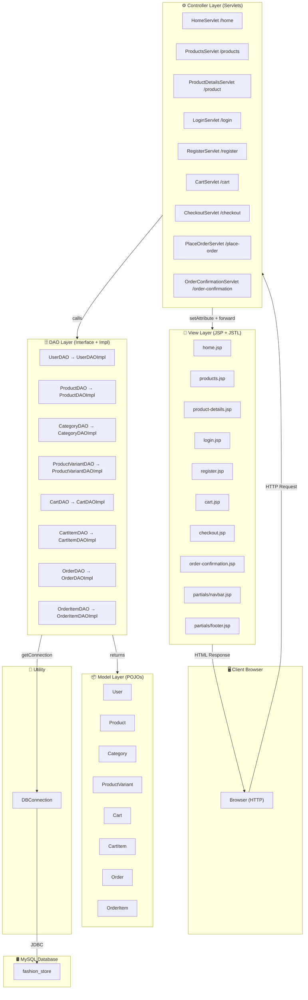

---

## 2. Package Structure

```
com.fashionstore
├── controller/                  ← Servlet controllers (handle HTTP)
│   ├── HomeServlet.java
│   ├── LoginServlet.java
│   ├── RegisterServlet.java
│   ├── ProductsServlet.java
│   ├── ProductDetailsServlet.java
│   ├── CartServlet.java
│   ├── CheckoutServlet.java
│   ├── PlaceOrderServlet.java
│   └── OrderConfirmationServlet.java
│
├── dao/                         ← DAO interfaces
│   ├── UserDAO.java
│   ├── ProductDAO.java
│   ├── CategoryDAO.java
│   ├── ProductVariantDAO.java
│   ├── CartDAO.java
│   ├── CartItemDAO.java
│   ├── OrderDAO.java
│   ├── OrderItemDAO.java
│   └── impl/                   ← DAO implementations (JDBC)
│       ├── UserDAOImpl.java
│       ├── ProductDAOImpl.java
│       ├── CategoryDAOImpl.java
│       ├── ProductVariantDAOImpl.java
│       ├── CartDAOImpl.java
│       ├── CartItemDAOImpl.java
│       ├── OrderDAOImpl.java
│       └── OrderItemDAOImpl.java
│
├── model/                       ← POJO model classes
│   ├── User.java
│   ├── Product.java
│   ├── Category.java
│   ├── ProductVariant.java
│   ├── Cart.java
│   ├── CartItem.java
│   ├── Order.java
│   └── OrderItem.java
│
└── util/                        ← Utility classes
    ├── DBConnection.java
    ├── TestConnection.java
    └── TestDAO.java

webapp/
├── index.html                   ← Landing redirect
├── assets/
│   ├── css/                     ← Page-specific stylesheets
│   └── images/
├── WEB-INF/
│   ├── web.xml                  ← Deployment descriptor
│   └── views/                   ← Protected JSP views
│       ├── home.jsp
│       ├── products.jsp
│       ├── product-details.jsp
│       ├── login.jsp
│       ├── register.jsp
│       ├── cart.jsp
│       ├── checkout.jsp
│       ├── order-confirmation.jsp
│       └── partials/
│           ├── navbar.jsp
│           └── footer.jsp
```

---

## 3. Class Diagram — Model Layer

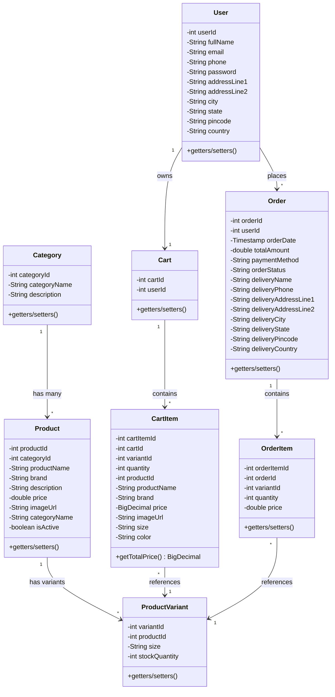

---

## 4. Class Diagram — DAO Layer

```mermaid
classDiagram
    class UserDAO {
        <<interface>>
        +registerUser(User) boolean
        +loginUser(email, password) User
        +getUserById(int) User
        +getUserByEmail(String) User
        +getUserByPhone(String) User
        +updateUser(User) boolean
        +updatePassword(int, String) boolean
        +deleteUser(int) boolean
        +emailExists(String) boolean
        +phoneExists(String) boolean
        +getAllUsers() List~User~
    }

    class ProductDAO {
        <<interface>>
        +getAllProducts() List~Product~
        +getProductById(int) Product
        +getProductsByCategory(int) List~Product~
        +searchProducts(String) List~Product~
        +filterProducts(int, double, double) List~Product~
        +filterProducts(int, String, double, double) List~Product~
        +getProductsByCategoryName(String) List~Product~
        +getVariantsByProductId(int) List~ProductVariant~
        +addProduct(Product) boolean
        +updateProduct(Product) boolean
        +deleteProduct(int) boolean
    }

    class CategoryDAO {
        <<interface>>
        +getAllCategories() List~Category~
        +getCategoryById(int) Category
        +getCategoryByName(String) Category
        +addCategory(Category) boolean
        +updateCategory(Category) boolean
        +deleteCategory(int) boolean
    }

    class ProductVariantDAO {
        <<interface>>
        +getVariantsByProductId(int) List~ProductVariant~
        +getVariantById(int) ProductVariant
        +getVariantByProductAndSize(int, String) ProductVariant
        +getStockByVariantId(int) int
        +updateStock(int, int) boolean
        +reduceStock(int, int) void
        +addVariant(ProductVariant) boolean
        +updateVariant(ProductVariant) boolean
        +deleteVariant(int) boolean
    }

    class CartDAO {
        <<interface>>
        +createCart(int) boolean
        +getCartById(int) Cart
        +getCartByUserId(int) Cart
        +getOrCreateCartByUserId(int) Cart
        +deleteCart(int) boolean
        +cartExistsByUserId(int) boolean
    }

    class CartItemDAO {
        <<interface>>
        +addCartItem(CartItem) boolean
        +updateCartItemQuantity(int, int) boolean
        +updateCartItemQuantityByCartAndVariant(int, int, int) boolean
        +removeCartItem(int) boolean
        +getCartItems(int) List~CartItem~
        +getCartTotal(int) BigDecimal
    }

    class OrderDAO {
        <<interface>>
        +createOrder(Order) int
        +getOrderById(int) Order
        +getOrdersByUserId(int) List~Order~
        +updateOrderStatus(int, String) boolean
        +deleteOrder(int) boolean
    }

    class OrderItemDAO {
        <<interface>>
        +addOrderItem(OrderItem) boolean
        +addOrderItems(List~OrderItem~) boolean
        +getItemsByOrderId(int) List~OrderItem~
        +deleteOrderItem(int) boolean
        +clearOrderItems(int) boolean
    }

    UserDAO <|.. UserDAOImpl
    ProductDAO <|.. ProductDAOImpl
    CategoryDAO <|.. CategoryDAOImpl
    ProductVariantDAO <|.. ProductVariantDAOImpl
    CartDAO <|.. CartDAOImpl
    CartItemDAO <|.. CartItemDAOImpl
    OrderDAO <|.. OrderDAOImpl
    OrderItemDAO <|.. OrderItemDAOImpl
```

---

## 5. Sequence Diagrams

### 5.1 User Registration Flow

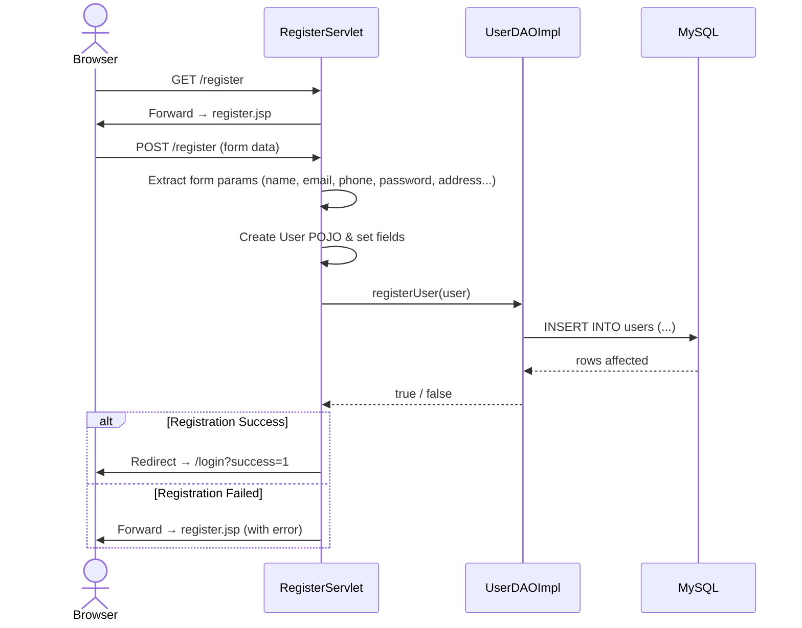

### 5.2 User Login Flow

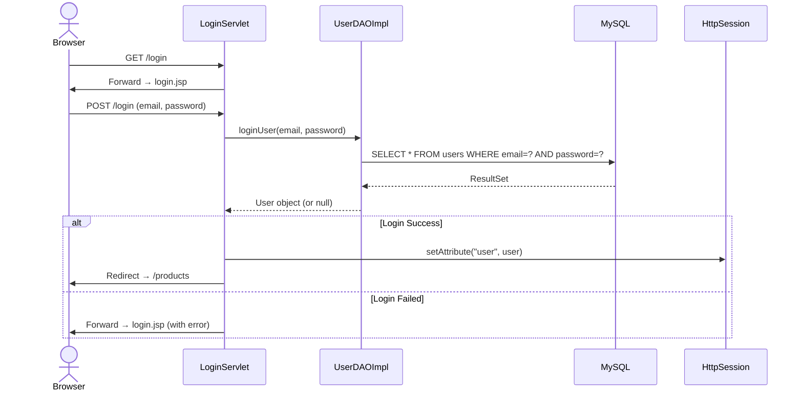

### 5.3 Browse Products Flow

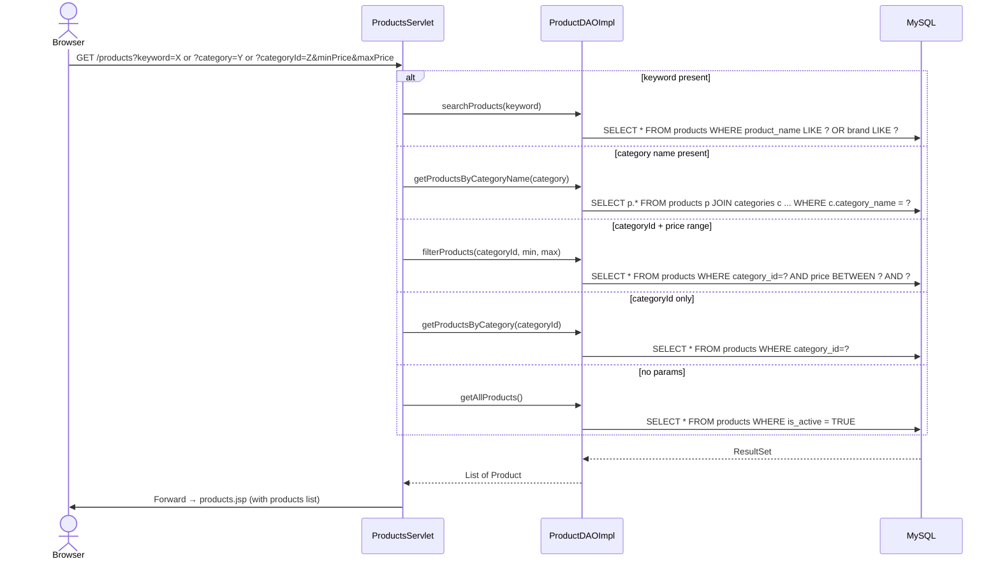

### 5.4 View Product Details Flow

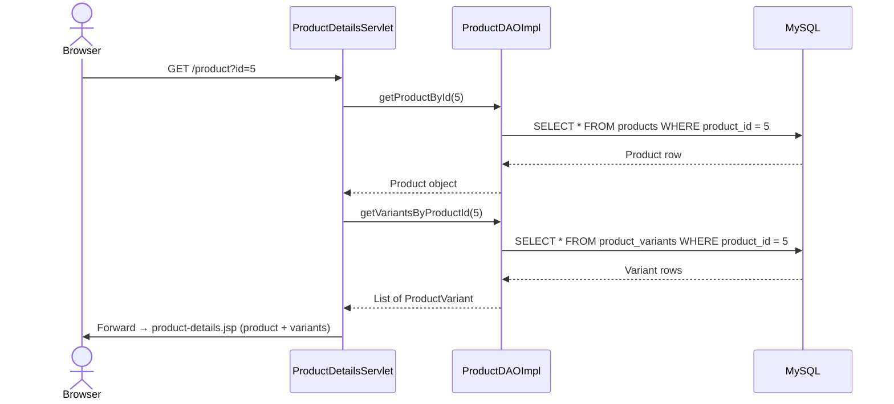

### 5.5 Add to Cart Flow

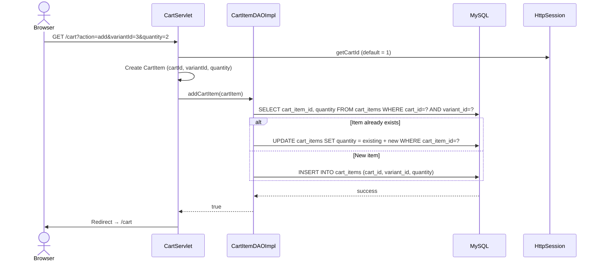

### 5.6 View Cart Flow

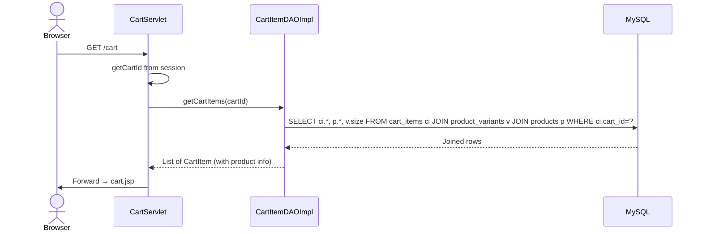

### 5.7 Checkout Flow

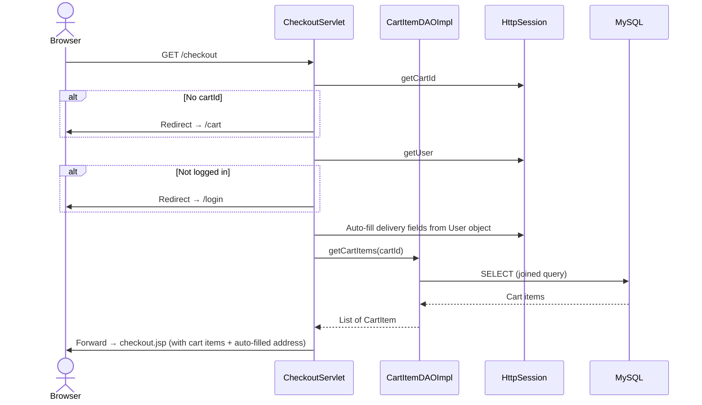

### 5.8 Place Order Flow (Most Complex)

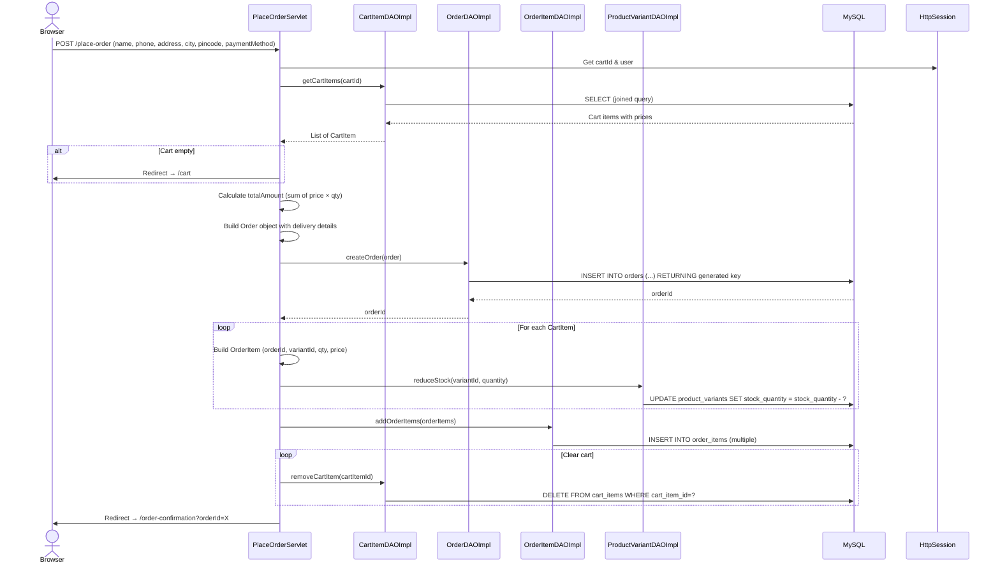

### 5.9 Order Confirmation Flow

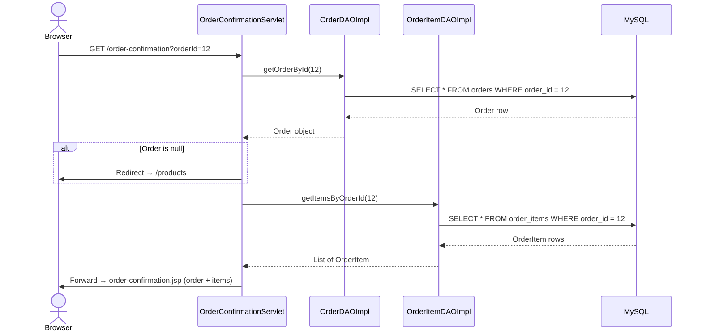

---

## 6. Request Routing Map

| HTTP Method | URL Pattern | Servlet | View (JSP) |
|---|---|---|---|
| GET | `/home` | HomeServlet | home.jsp |
| GET | `/login` | LoginServlet | login.jsp |
| POST | `/login` | LoginServlet | Redirect → `/products` |
| GET | `/register` | RegisterServlet | register.jsp |
| POST | `/register` | RegisterServlet | Redirect → `/login` |
| GET | `/products` | ProductsServlet | products.jsp |
| GET | `/product?id=X` | ProductDetailsServlet | product-details.jsp |
| GET | `/cart` | CartServlet | cart.jsp |
| GET | `/cart?action=add` | CartServlet | Redirect → `/cart` |
| GET | `/cart?action=update` | CartServlet | Redirect → `/cart` |
| GET | `/cart?action=remove` | CartServlet | Redirect → `/cart` |
| GET | `/checkout` | CheckoutServlet | checkout.jsp |
| POST | `/place-order` | PlaceOrderServlet | Redirect → `/order-confirmation` |
| GET | `/order-confirmation?orderId=X` | OrderConfirmationServlet | order-confirmation.jsp |

---

## 7. Session Management

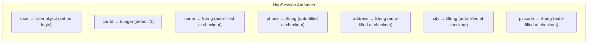

| Attribute | Type | Set By | Used By |
|---|---|---|---|
| `user` | `User` | LoginServlet (on success) | CheckoutServlet, PlaceOrderServlet |
| `cartId` | `Integer` | CartServlet (default=1) | CartServlet, CheckoutServlet, PlaceOrderServlet |
| `name` | `String` | CheckoutServlet (auto-fill) | checkout.jsp |
| `phone` | `String` | CheckoutServlet (auto-fill) | checkout.jsp |
| `address` | `String` | CheckoutServlet (auto-fill) | checkout.jsp |
| `city` | `String` | CheckoutServlet (auto-fill) | checkout.jsp |
| `pincode` | `String` | CheckoutServlet (auto-fill) | checkout.jsp |
