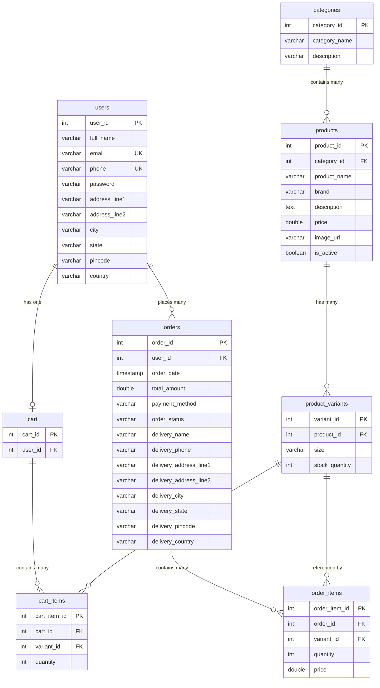
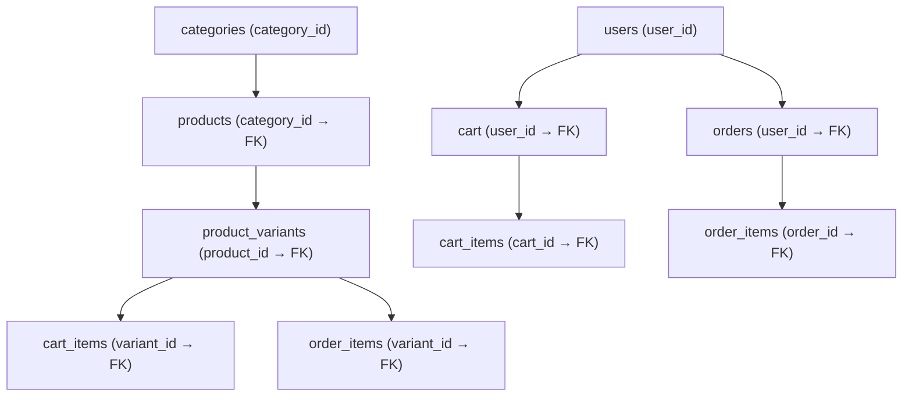

# FashionStore — Database Documentation

> **Database**: MySQL 8  
> **Schema Name**: `fashion_store`  
> **Connection**: `jdbc:mysql://localhost:3306/fashion_store`  
> **Driver**: `com.mysql.cj.jdbc.Driver`

---

## 1. Entity-Relationship Diagram



---

## 2. Table Definitions

### 2.1 `users`

Stores registered customer information including authentication and shipping address.

| Column | Type | Constraints | Description |
|---|---|---|---|
| `user_id` | INT | PK, AUTO_INCREMENT | Unique user identifier |
| `full_name` | VARCHAR | NOT NULL | Customer's full name |
| `email` | VARCHAR | UNIQUE, NOT NULL | Login email (unique) |
| `phone` | VARCHAR | UNIQUE | Contact number |
| `password` | VARCHAR | NOT NULL | Plain-text password (no hashing) |
| `address_line1` | VARCHAR | | Primary address |
| `address_line2` | VARCHAR | | Secondary address |
| `city` | VARCHAR | | City |
| `state` | VARCHAR | | State/Province |
| `pincode` | VARCHAR | | Postal/ZIP code |
| `country` | VARCHAR | | Country |

> **Mapped Model Class**: [User.java](file:///c:/Users/Admin/Desktop/FashionStore/src/main/java/com/fashionstore/model/User.java)  
> **DAO Interface**: [UserDAO.java](file:///c:/Users/Admin/Desktop/FashionStore/src/main/java/com/fashionstore/dao/UserDAO.java)  
> **DAO Implementation**: [UserDAOImpl.java](file:///c:/Users/Admin/Desktop/FashionStore/src/main/java/com/fashionstore/dao/impl/UserDAOImpl.java)

**Column → Field Mapping:**

| DB Column | Java Field | Java Type |
|---|---|---|
| `user_id` | `userId` | `int` |
| `full_name` | `fullName` | `String` |
| `email` | `email` | `String` |
| `phone` | `phone` | `String` |
| `password` | `password` | `String` |
| `address_line1` | `addressLine1` | `String` |
| `address_line2` | `addressLine2` | `String` |
| `city` | `city` | `String` |
| `state` | `state` | `String` |
| `pincode` | `pincode` | `String` |
| `country` | `country` | `String` |

---

### 2.2 `categories`

Product category master table.

| Column | Type | Constraints | Description |
|---|---|---|---|
| `category_id` | INT | PK, AUTO_INCREMENT | Unique category identifier |
| `category_name` | VARCHAR | NOT NULL | Name (e.g., "Men", "Women", "Kids") |
| `description` | VARCHAR | | Category description |

> **Mapped Model Class**: [Category.java](file:///c:/Users/Admin/Desktop/FashionStore/src/main/java/com/fashionstore/model/Category.java)  
> **DAO Interface**: [CategoryDAO.java](file:///c:/Users/Admin/Desktop/FashionStore/src/main/java/com/fashionstore/dao/CategoryDAO.java)  
> **DAO Implementation**: [CategoryDAOImpl.java](file:///c:/Users/Admin/Desktop/FashionStore/src/main/java/com/fashionstore/dao/impl/CategoryDAOImpl.java)

**Column → Field Mapping:**

| DB Column | Java Field | Java Type |
|---|---|---|
| `category_id` | `categoryId` | `int` |
| `category_name` | `categoryName` | `String` |
| `description` | `description` | `String` |

---

### 2.3 `products`

Core product catalog. Each product belongs to one category.

| Column | Type | Constraints | Description |
|---|---|---|---|
| `product_id` | INT | PK, AUTO_INCREMENT | Unique product identifier |
| `category_id` | INT | FK → `categories.category_id` | Parent category |
| `product_name` | VARCHAR | NOT NULL | Product title |
| `brand` | VARCHAR | | Brand name |
| `description` | TEXT | | Detailed product description |
| `price` | DOUBLE | NOT NULL | Base price |
| `image_url` | VARCHAR | | Product image URL |
| `is_active` | BOOLEAN | DEFAULT TRUE | Soft-delete flag |

> **Mapped Model Class**: [Product.java](file:///c:/Users/Admin/Desktop/FashionStore/src/main/java/com/fashionstore/model/Product.java)  
> **DAO Interface**: [ProductDAO.java](file:///c:/Users/Admin/Desktop/FashionStore/src/main/java/com/fashionstore/dao/ProductDAO.java)  
> **DAO Implementation**: [ProductDAOImpl.java](file:///c:/Users/Admin/Desktop/FashionStore/src/main/java/com/fashionstore/dao/impl/ProductDAOImpl.java)

**Column → Field Mapping:**

| DB Column | Java Field | Java Type |
|---|---|---|
| `product_id` | `productId` | `int` |
| `category_id` | `categoryId` | `int` |
| `product_name` | `productName` | `String` |
| `brand` | `brand` | `String` |
| `description` | `description` | `String` |
| `price` | `price` | `double` |
| `image_url` | `imageUrl` | `String` |
| `is_active` | `isActive` | `boolean` |

> [!NOTE]
> The `categoryName` field in the Product model is a transient/display field — it is NOT a database column. It exists for convenience when joining with the `categories` table.

---

### 2.4 `product_variants`

Size variants for each product, each with independent stock tracking.

| Column | Type | Constraints | Description |
|---|---|---|---|
| `variant_id` | INT | PK, AUTO_INCREMENT | Unique variant identifier |
| `product_id` | INT | FK → `products.product_id` | Parent product |
| `size` | VARCHAR | NOT NULL | Size label (S, M, L, XL, etc.) |
| `stock_quantity` | INT | DEFAULT 0 | Available inventory count |

> **Mapped Model Class**: [ProductVariant.java](file:///c:/Users/Admin/Desktop/FashionStore/src/main/java/com/fashionstore/model/ProductVariant.java)  
> **DAO Interface**: [ProductVariantDAO.java](file:///c:/Users/Admin/Desktop/FashionStore/src/main/java/com/fashionstore/dao/ProductVariantDAO.java)  
> **DAO Implementation**: [ProductVariantDAOImpl.java](file:///c:/Users/Admin/Desktop/FashionStore/src/main/java/com/fashionstore/dao/impl/ProductVariantDAOImpl.java)

**Column → Field Mapping:**

| DB Column | Java Field | Java Type |
|---|---|---|
| `variant_id` | `variantId` | `int` |
| `product_id` | `productId` | `int` |
| `size` | `size` | `String` |
| `stock_quantity` | `stockQuantity` | `int` |

---

### 2.5 `cart`

One cart per user. Acts as a header table for cart items.

| Column | Type | Constraints | Description |
|---|---|---|---|
| `cart_id` | INT | PK, AUTO_INCREMENT | Unique cart identifier |
| `user_id` | INT | FK → `users.user_id` | Owner of the cart |

> **Mapped Model Class**: [Cart.java](file:///c:/Users/Admin/Desktop/FashionStore/src/main/java/com/fashionstore/model/Cart.java)  
> **DAO Interface**: [CartDAO.java](file:///c:/Users/Admin/Desktop/FashionStore/src/main/java/com/fashionstore/dao/CartDAO.java)  
> **DAO Implementation**: [CartDAOImpl.java](file:///c:/Users/Admin/Desktop/FashionStore/src/main/java/com/fashionstore/dao/impl/CartDAOImpl.java)

**Column → Field Mapping:**

| DB Column | Java Field | Java Type |
|---|---|---|
| `cart_id` | `cartId` | `int` |
| `user_id` | `userId` | `int` |

---

### 2.6 `cart_items`

Line items within a cart. Each row links a specific product variant (size) with a quantity.

| Column | Type | Constraints | Description |
|---|---|---|---|
| `cart_item_id` | INT | PK, AUTO_INCREMENT | Unique line item identifier |
| `cart_id` | INT | FK → `cart.cart_id` | Parent cart |
| `variant_id` | INT | FK → `product_variants.variant_id` | Selected size variant |
| `quantity` | INT | NOT NULL | Quantity selected |

> **Mapped Model Class**: [CartItem.java](file:///c:/Users/Admin/Desktop/FashionStore/src/main/java/com/fashionstore/model/CartItem.java)  
> **DAO Interface**: [CartItemDAO.java](file:///c:/Users/Admin/Desktop/FashionStore/src/main/java/com/fashionstore/dao/CartItemDAO.java)  
> **DAO Implementation**: [CartItemDAOImpl.java](file:///c:/Users/Admin/Desktop/FashionStore/src/main/java/com/fashionstore/dao/impl/CartItemDAOImpl.java)

**Column → Field Mapping (DB columns):**

| DB Column | Java Field | Java Type |
|---|---|---|
| `cart_item_id` | `cartItemId` | `int` |
| `cart_id` | `cartId` | `int` |
| `variant_id` | `variantId` | `int` |
| `quantity` | `quantity` | `int` |

**Additional display fields (populated via JOIN in `getCartItems` query):**

| Source Table | DB Column | Java Field | Java Type |
|---|---|---|---|
| `products` | `product_id` | `productId` | `int` |
| `products` | `product_name` | `productName` | `String` |
| `products` | `brand` | `brand` | `String` |
| `products` | `price` | `price` | `BigDecimal` |
| `products` | `image_url` | `imageUrl` | `String` |
| `product_variants` | `size` | `size` | `String` |

> [!IMPORTANT]
> The `getCartItems()` query performs a **3-table JOIN** (`cart_items` → `product_variants` → `products`) to populate display fields in a single query, avoiding N+1 queries.

---

### 2.7 `orders`

Order header with delivery details. Created when a user places an order.

| Column | Type | Constraints | Description |
|---|---|---|---|
| `order_id` | INT | PK, AUTO_INCREMENT | Unique order identifier |
| `user_id` | INT | FK → `users.user_id` | Customer who placed the order |
| `order_date` | TIMESTAMP | DEFAULT CURRENT_TIMESTAMP | When the order was placed |
| `total_amount` | DOUBLE | NOT NULL | Total order value |
| `payment_method` | VARCHAR | | Payment type (COD, UPI, Card, etc.) |
| `order_status` | VARCHAR | DEFAULT 'PLACED' | Status: PLACED / SHIPPED / DELIVERED / CANCELLED |
| `delivery_name` | VARCHAR | | Recipient name |
| `delivery_phone` | VARCHAR | | Recipient phone |
| `delivery_address_line1` | VARCHAR | | Delivery address line 1 |
| `delivery_address_line2` | VARCHAR | | Delivery address line 2 |
| `delivery_city` | VARCHAR | | Delivery city |
| `delivery_state` | VARCHAR | | Delivery state |
| `delivery_pincode` | VARCHAR | | Delivery pincode |
| `delivery_country` | VARCHAR | | Delivery country |

> **Mapped Model Class**: [Order.java](file:///c:/Users/Admin/Desktop/FashionStore/src/main/java/com/fashionstore/model/Order.java)  
> **DAO Interface**: [OrderDAO.java](file:///c:/Users/Admin/Desktop/FashionStore/src/main/java/com/fashionstore/dao/OrderDAO.java)  
> **DAO Implementation**: [OrderDAOImpl.java](file:///c:/Users/Admin/Desktop/FashionStore/src/main/java/com/fashionstore/dao/impl/OrderDAOImpl.java)

**Column → Field Mapping:**

| DB Column | Java Field | Java Type |
|---|---|---|
| `order_id` | `orderId` | `int` |
| `user_id` | `userId` | `int` |
| `order_date` | `orderDate` | `Timestamp` |
| `total_amount` | `totalAmount` | `double` |
| `payment_method` | `paymentMethod` | `String` |
| `order_status` | `orderStatus` | `String` |
| `delivery_name` | `deliveryName` | `String` |
| `delivery_phone` | `deliveryPhone` | `String` |
| `delivery_address_line1` | `deliveryAddressLine1` | `String` |
| `delivery_address_line2` | `deliveryAddressLine2` | `String` |
| `delivery_city` | `deliveryCity` | `String` |
| `delivery_state` | `deliveryState` | `String` |
| `delivery_pincode` | `deliveryPincode` | `String` |
| `delivery_country` | `deliveryCountry` | `String` |

---

### 2.8 `order_items`

Line items within an order. Price is captured at order time (snapshot).

| Column | Type | Constraints | Description |
|---|---|---|---|
| `order_item_id` | INT | PK, AUTO_INCREMENT | Unique line item identifier |
| `order_id` | INT | FK → `orders.order_id` | Parent order |
| `variant_id` | INT | FK → `product_variants.variant_id` | Product variant ordered |
| `quantity` | INT | NOT NULL | Quantity ordered |
| `price` | DOUBLE | NOT NULL | Unit price at time of order |

> **Mapped Model Class**: [OrderItem.java](file:///c:/Users/Admin/Desktop/FashionStore/src/main/java/com/fashionstore/model/OrderItem.java)  
> **DAO Interface**: [OrderItemDAO.java](file:///c:/Users/Admin/Desktop/FashionStore/src/main/java/com/fashionstore/dao/OrderItemDAO.java)  
> **DAO Implementation**: [OrderItemDAOImpl.java](file:///c:/Users/Admin/Desktop/FashionStore/src/main/java/com/fashionstore/dao/impl/OrderItemDAOImpl.java)

**Column → Field Mapping:**

| DB Column | Java Field | Java Type |
|---|---|---|
| `order_item_id` | `orderItemId` | `int` |
| `order_id` | `orderId` | `int` |
| `variant_id` | `variantId` | `int` |
| `quantity` | `quantity` | `int` |
| `price` | `price` | `double` |

---

## 3. Foreign Key Relationships Summary



| Parent Table | Parent Key | Child Table | Foreign Key | Relationship |
|---|---|---|---|---|
| `users` | `user_id` | `cart` | `user_id` | One-to-One |
| `users` | `user_id` | `orders` | `user_id` | One-to-Many |
| `categories` | `category_id` | `products` | `category_id` | One-to-Many |
| `products` | `product_id` | `product_variants` | `product_id` | One-to-Many |
| `cart` | `cart_id` | `cart_items` | `cart_id` | One-to-Many |
| `product_variants` | `variant_id` | `cart_items` | `variant_id` | Many-to-One |
| `orders` | `order_id` | `order_items` | `order_id` | One-to-Many |
| `product_variants` | `variant_id` | `order_items` | `variant_id` | Many-to-One |

---

## 4. Key SQL Queries Used in the Application

### 4.1 User Queries (UserDAOImpl)

```sql
-- Register
INSERT INTO users (full_name, email, phone, password,
    address_line1, address_line2, city, state, pincode, country)
VALUES (?, ?, ?, ?, ?, ?, ?, ?, ?, ?)

-- Login
SELECT * FROM users WHERE email = ? AND password = ?

-- Fetch by ID / Email / Phone
SELECT * FROM users WHERE user_id = ?
SELECT * FROM users WHERE email = ?
SELECT * FROM users WHERE phone = ?

-- Validation
SELECT 1 FROM users WHERE email = ?
SELECT 1 FROM users WHERE phone = ?

-- Update
UPDATE users SET full_name=?, phone=?, address_line1=?, address_line2=?,
    city=?, state=?, pincode=?, country=? WHERE user_id = ?
UPDATE users SET password = ? WHERE user_id = ?

-- Delete
DELETE FROM users WHERE user_id = ?
```

### 4.2 Product Queries (ProductDAOImpl)

```sql
-- All active products
SELECT * FROM products WHERE is_active = TRUE

-- By ID
SELECT * FROM products WHERE product_id = ?

-- By category ID
SELECT * FROM products WHERE category_id = ? AND is_active = TRUE

-- Search (name or brand)
SELECT * FROM products WHERE product_name LIKE ? OR brand LIKE ?

-- Filter by category + price range
SELECT * FROM products WHERE category_id = ? AND price BETWEEN ? AND ? AND is_active = TRUE

-- Filter by category + keyword + price range
SELECT * FROM products WHERE category_id = ?
    AND (product_name LIKE ? OR brand LIKE ?)
    AND price BETWEEN ? AND ? AND is_active = TRUE

-- By category NAME (JOIN)
SELECT p.* FROM products p
JOIN categories c ON p.category_id = c.category_id
WHERE c.category_name = ? AND p.is_active = TRUE

-- Get variants for a product
SELECT * FROM product_variants WHERE product_id = ?
```

### 4.3 Cart Queries (CartDAOImpl + CartItemDAOImpl)

```sql
-- Create cart
INSERT INTO cart (user_id) VALUES (?)

-- Get cart
SELECT * FROM cart WHERE cart_id = ?
SELECT * FROM cart WHERE user_id = ?

-- Check existence
SELECT 1 FROM cart WHERE user_id = ?

-- Add item (with duplicate check)
SELECT cart_item_id, quantity FROM cart_items WHERE cart_id = ? AND variant_id = ?
INSERT INTO cart_items (cart_id, variant_id, quantity) VALUES (?, ?, ?)
UPDATE cart_items SET quantity = ? WHERE cart_item_id = ?

-- Get cart items (3-table JOIN)
SELECT ci.cart_item_id, ci.cart_id, ci.variant_id, ci.quantity,
       p.product_id, p.product_name, p.brand, p.price, p.image_url,
       v.size
FROM cart_items ci
JOIN product_variants v ON ci.variant_id = v.variant_id
JOIN products p ON v.product_id = p.product_id
WHERE ci.cart_id = ?

-- Remove item
DELETE FROM cart_items WHERE cart_item_id = ?
```

### 4.4 Order Queries (OrderDAOImpl + OrderItemDAOImpl)

```sql
-- Create order (returns generated key)
INSERT INTO orders (user_id, total_amount, payment_method, order_status,
    delivery_name, delivery_phone,
    delivery_address_line1, delivery_address_line2,
    delivery_city, delivery_state, delivery_pincode, delivery_country)
VALUES (?, ?, ?, ?, ?, ?, ?, ?, ?, ?, ?, ?)

-- Get order
SELECT * FROM orders WHERE order_id = ?
SELECT * FROM orders WHERE user_id = ? ORDER BY order_date DESC

-- Update status
UPDATE orders SET order_status = ? WHERE order_id = ?

-- Add order item
INSERT INTO order_items (order_id, variant_id, quantity, price) VALUES (?, ?, ?, ?)

-- Get items for order
SELECT * FROM order_items WHERE order_id = ?

-- Stock reduction (during order placement)
UPDATE product_variants SET stock_quantity = stock_quantity - ? WHERE variant_id = ?
```

---

## 5. Database Connection Configuration

The connection is managed by [DBConnection.java](file:///c:/Users/Admin/Desktop/FashionStore/src/main/java/com/fashionstore/util/DBConnection.java):

| Property | Value |
|---|---|
| URL | Environment variable `DB_URL` / `MYSQL_URL` or `db.properties` |
| Username | Environment variable `DB_USER` / `MYSQLUSER` or `db.properties` |
| Password | Environment variable `DB_PASSWORD` / `MYSQLPASSWORD` or `db.properties` (Secured / Gitignored) |
| Driver | `com.mysql.cj.jdbc.Driver` |
| Loading | Static initializer with classpath property and environment variable resolver |
| Pattern | Connection via `DBConnection.getConnection()` |

> [!WARNING]
> **Security concerns**: The database password is hardcoded in the source code and passwords are stored in plain text (no hashing). These should be addressed before production deployment.
