# FashionStore — Controller ↔ DAO Dependency Map

> This document maps every servlet controller to the exact DAO classes it depends on, the model objects it works with, the JSP views it renders, and the HTTP session attributes it reads/writes.

---

## 1. Complete Dependency Matrix

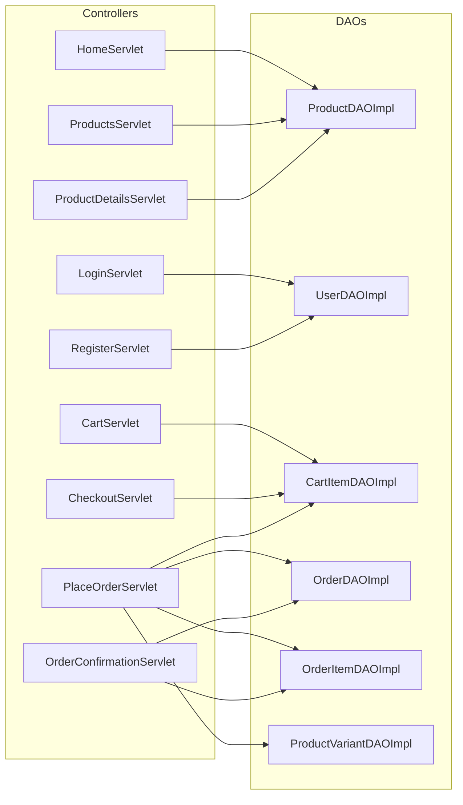

### Summary Table

| Controller | DAO Dependencies | Models Used | View |
|---|---|---|---|
| HomeServlet | ProductDAO | Product | home.jsp |
| LoginServlet | UserDAO | User | login.jsp |
| RegisterServlet | UserDAO | User | register.jsp |
| ProductsServlet | ProductDAO | Product | products.jsp |
| ProductDetailsServlet | ProductDAO | Product, ProductVariant | product-details.jsp |
| CartServlet | CartItemDAO | CartItem | cart.jsp |
| CheckoutServlet | CartItemDAO | CartItem, User | checkout.jsp |
| PlaceOrderServlet | CartItemDAO, OrderDAO, OrderItemDAO, ProductVariantDAO | CartItem, Order, OrderItem, User | *(redirect only)* |
| OrderConfirmationServlet | OrderDAO, OrderItemDAO | Order, OrderItem | order-confirmation.jsp |

---

## 2. Per-Controller Deep Dive

### 2.1 HomeServlet (`/home`)

**Source**: [HomeServlet.java](file:///c:/Users/Admin/Desktop/FashionStore/src/main/java/com/fashionstore/controller/HomeServlet.java)

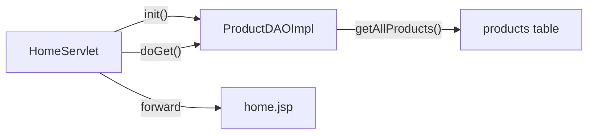

| Aspect | Detail |
|---|---|
| **HTTP Methods** | GET |
| **DAO Injected** | `ProductDAO` → `new ProductDAOImpl()` |
| **DAO Methods Called** | `getAllProducts()` |
| **Request Attributes Set** | `products` → `List<Product>` |
| **Session Usage** | None |
| **Forward/Redirect** | Forward → `/WEB-INF/views/home.jsp` |

---

### 2.2 LoginServlet (`/login`)

**Source**: [LoginServlet.java](file:///c:/Users/Admin/Desktop/FashionStore/src/main/java/com/fashionstore/controller/LoginServlet.java)

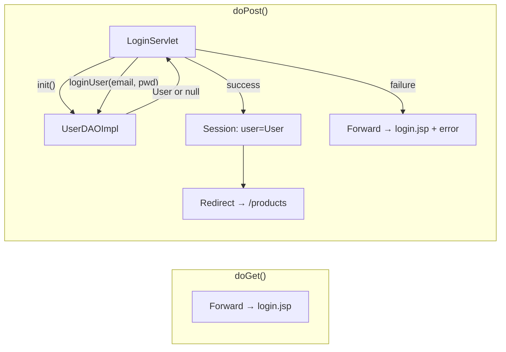

| Aspect | Detail |
|---|---|
| **HTTP Methods** | GET, POST |
| **DAO Injected** | `UserDAO` → `new UserDAOImpl()` |
| **DAO Methods Called** | `loginUser(email, password)` |
| **Request Attributes Set** | `error` → `String` (on failure) |
| **Session Writes** | `user` → `User` object (on success) |
| **Forward/Redirect** | GET: Forward → login.jsp · POST success: Redirect → `/products` · POST fail: Forward → login.jsp |

---

### 2.3 RegisterServlet (`/register`)

**Source**: [RegisterServlet.java](file:///c:/Users/Admin/Desktop/FashionStore/src/main/java/com/fashionstore/controller/RegisterServlet.java)

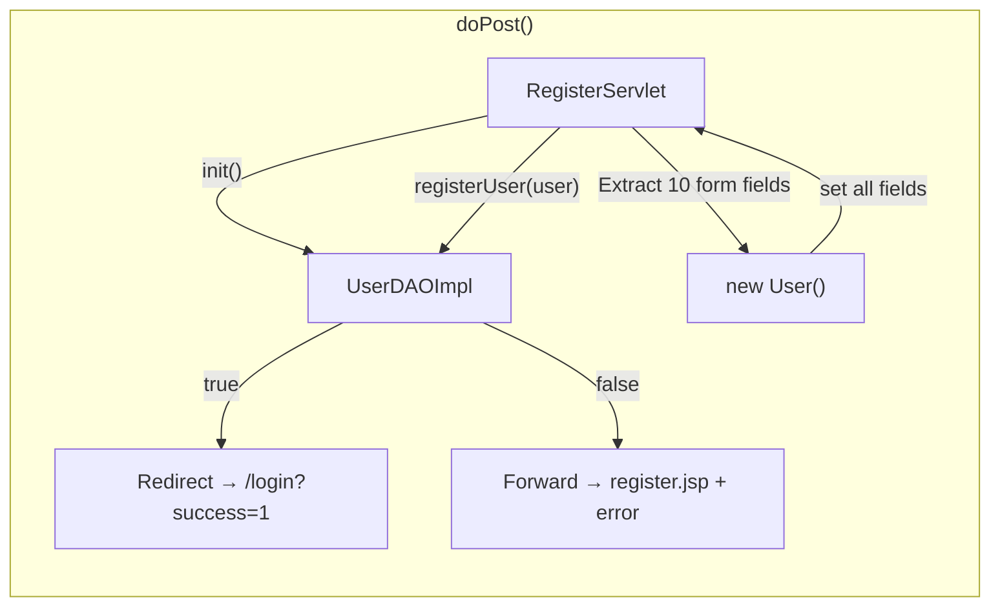

| Aspect | Detail |
|---|---|
| **HTTP Methods** | GET, POST |
| **DAO Injected** | `UserDAO` → `new UserDAOImpl()` |
| **DAO Methods Called** | `registerUser(user)` |
| **Form Parameters Read** | `fullName`, `email`, `phone`, `password`, `addressLine1`, `addressLine2`, `city`, `state`, `pincode`, `country` |
| **Request Attributes Set** | `error` → `String` (on failure) |
| **Forward/Redirect** | GET: Forward → register.jsp · POST success: Redirect → `/login?success=1` · POST fail: Forward → register.jsp |

---

### 2.4 ProductsServlet (`/products`)

**Source**: [ProductsServlet.java](file:///c:/Users/Admin/Desktop/FashionStore/src/main/java/com/fashionstore/controller/ProductsServlet.java)

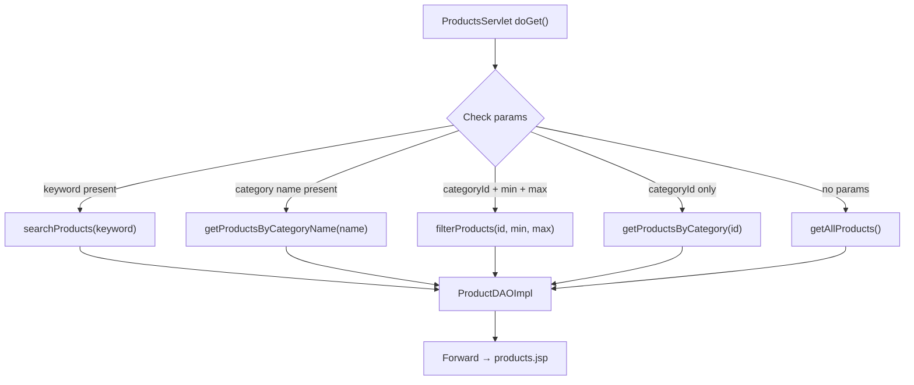

| Aspect | Detail |
|---|---|
| **HTTP Methods** | GET |
| **DAO Injected** | `ProductDAO` → `new ProductDAOImpl()` |
| **DAO Methods Called** | `searchProducts()`, `getProductsByCategoryName()`, `filterProducts()`, `getProductsByCategory()`, `getAllProducts()` |
| **Query Parameters** | `keyword`, `category`, `categoryId`, `minPrice`, `maxPrice` |
| **Request Attributes Set** | `products` → `List<Product>` |
| **Forward/Redirect** | Forward → `/WEB-INF/views/products.jsp` |

---

### 2.5 ProductDetailsServlet (`/product`)

**Source**: [ProductDetailsServlet.java](file:///c:/Users/Admin/Desktop/FashionStore/src/main/java/com/fashionstore/controller/ProductDetailsServlet.java)

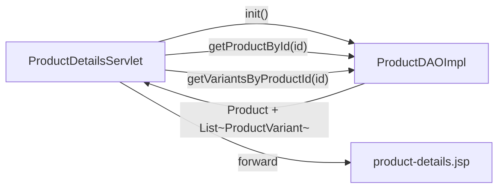

| Aspect | Detail |
|---|---|
| **HTTP Methods** | GET |
| **DAO Injected** | `ProductDAO` → `new ProductDAOImpl()` |
| **DAO Methods Called** | `getProductById(id)`, `getVariantsByProductId(id)` |
| **Query Parameters** | `id` (product ID) |
| **Request Attributes Set** | `product` → `Product`, `variants` → `List<ProductVariant>` |
| **Forward/Redirect** | Forward → `/WEB-INF/views/product-details.jsp` |

---

### 2.6 CartServlet (`/cart`)

**Source**: [CartServlet.java](file:///c:/Users/Admin/Desktop/FashionStore/src/main/java/com/fashionstore/controller/CartServlet.java)

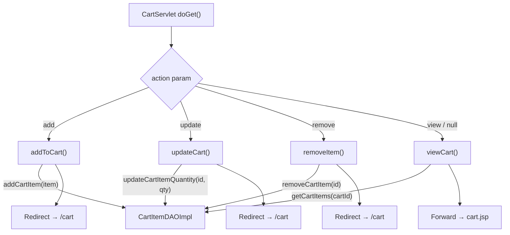

| Aspect | Detail |
|---|---|
| **HTTP Methods** | GET (all actions via query params) |
| **DAO Injected** | `CartItemDAO` → `new CartItemDAOImpl()` |
| **DAO Methods Called** | `addCartItem()`, `updateCartItemQuantity()`, `removeCartItem()`, `getCartItems()` |
| **Query Parameters** | `action` (add/update/remove/view), `variantId`, `quantity`, `cartItemId` |
| **Session Reads** | `cartId` (defaults to 1 if absent) |
| **Request Attributes Set** | `cartItems` → `List<CartItem>` (view action only) |
| **Forward/Redirect** | add/update/remove: Redirect → `/cart` · view: Forward → cart.jsp |

> [!NOTE]
> The `getCartId()` helper currently defaults to `cartId = 1` when no session value exists. This is a temporary implementation — in production, it should be linked to the logged-in user's cart.

---

### 2.7 CheckoutServlet (`/checkout`)

**Source**: [CheckoutServlet.java](file:///c:/Users/Admin/Desktop/FashionStore/src/main/java/com/fashionstore/controller/CheckoutServlet.java)

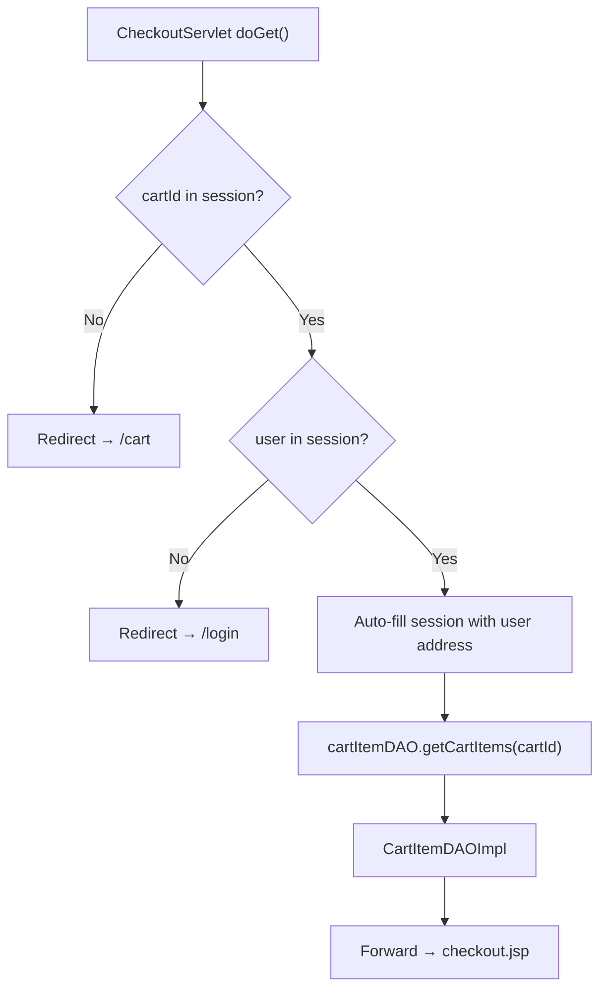

| Aspect | Detail |
|---|---|
| **HTTP Methods** | GET |
| **DAO Injected** | `CartItemDAO` → `new CartItemDAOImpl()` |
| **DAO Methods Called** | `getCartItems(cartId)` |
| **Session Reads** | `cartId`, `user` |
| **Session Writes** | `name`, `phone`, `address`, `city`, `pincode` (auto-filled from User) |
| **Request Attributes Set** | `cartItems` → `List<CartItem>` |
| **Guard Redirects** | No cartId → `/cart` · No user → `/login` |
| **Forward/Redirect** | Forward → `/WEB-INF/views/checkout.jsp` |

---

### 2.8 PlaceOrderServlet (`/place-order`) — Most Complex

**Source**: [PlaceOrderServlet.java](file:///c:/Users/Admin/Desktop/FashionStore/src/main/java/com/fashionstore/controller/PlaceOrderServlet.java)

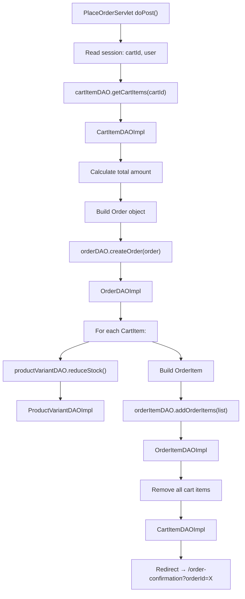

| Aspect | Detail |
|---|---|
| **HTTP Methods** | POST |
| **DAOs Injected (4)** | `CartItemDAO` → `CartItemDAOImpl`, `OrderDAO` → `OrderDAOImpl`, `OrderItemDAO` → `OrderItemDAOImpl`, `ProductVariantDAO` → `ProductVariantDAOImpl` |
| **DAO Methods Called** | `getCartItems()`, `createOrder()`, `addOrderItems()`, `reduceStock()`, `removeCartItem()` |
| **Form Parameters Read** | `name`, `phone`, `address`, `city`, `pincode`, `paymentMethod` |
| **Session Reads** | `cartId`, `user` |
| **Forward/Redirect** | Redirect → `/order-confirmation?orderId=X` |

**Execution Steps (in order):**

| Step | Action | DAO Used | Method |
|---|---|---|---|
| 1 | Get cart items | CartItemDAOImpl | `getCartItems(cartId)` |
| 2 | Calculate total | *(in-memory)* | Sum of `price × quantity` |
| 3 | Create order record | OrderDAOImpl | `createOrder(order)` → returns `orderId` |
| 4 | Reduce stock per item | ProductVariantDAOImpl | `reduceStock(variantId, qty)` |
| 5 | Save order items | OrderItemDAOImpl | `addOrderItems(list)` |
| 6 | Clear cart | CartItemDAOImpl | `removeCartItem(id)` per item |
| 7 | Redirect to confirmation | — | HTTP 302 |

---

### 2.9 OrderConfirmationServlet (`/order-confirmation`)

**Source**: [OrderConfirmationServlet.java](file:///c:/Users/Admin/Desktop/FashionStore/src/main/java/com/fashionstore/controller/OrderConfirmationServlet.java)

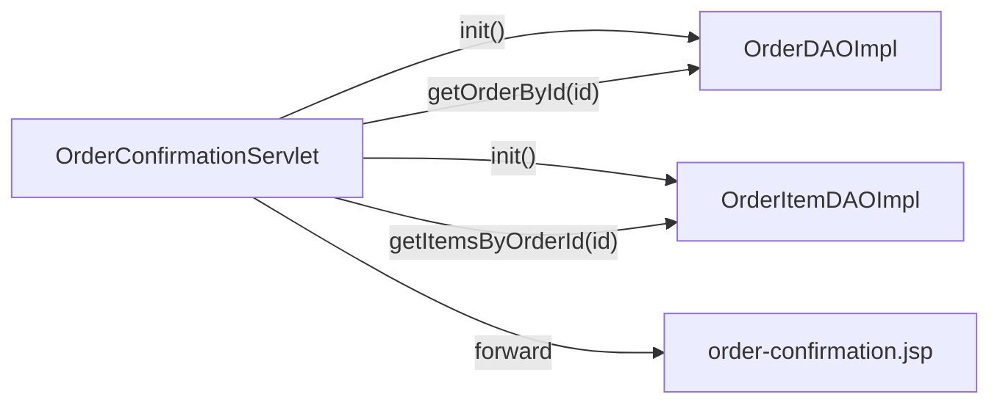

| Aspect | Detail |
|---|---|
| **HTTP Methods** | GET |
| **DAOs Injected (2)** | `OrderDAO` → `OrderDAOImpl`, `OrderItemDAO` → `OrderItemDAOImpl` |
| **DAO Methods Called** | `getOrderById(orderId)`, `getItemsByOrderId(orderId)` |
| **Query Parameters** | `orderId` |
| **Request Attributes Set** | `order` → `Order`, `orderItems` → `List<OrderItem>` |
| **Guard Redirects** | No orderId or order not found → `/products` |
| **Forward/Redirect** | Forward → `/WEB-INF/views/order-confirmation.jsp` |

---

## 3. DAO Instantiation Pattern

All controllers follow the same instantiation pattern — **manual `new` in `init()`**, no dependency injection framework:

```java
@Override
public void init() {
    productDAO = new ProductDAOImpl();   // interface reference, concrete impl
}
```

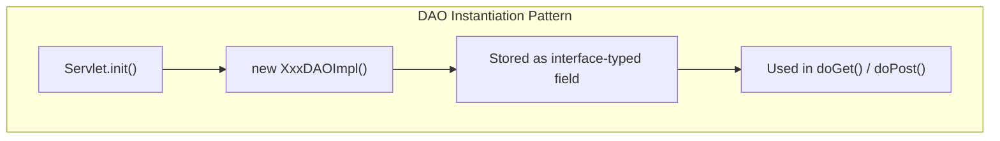

| Controller | Field Declaration | Initialization |
|---|---|---|
| HomeServlet | `private ProductDAO productDAO` | `new ProductDAOImpl()` |
| LoginServlet | `private UserDAO userDAO` | `new UserDAOImpl()` |
| RegisterServlet | `private UserDAO userDAO` | `new UserDAOImpl()` |
| ProductsServlet | `private ProductDAO productDAO` | `new ProductDAOImpl()` |
| ProductDetailsServlet | `private ProductDAO productDAO` | `new ProductDAOImpl()` |
| CartServlet | `private CartItemDAO cartItemDAO` | `new CartItemDAOImpl()` |
| CheckoutServlet | `private CartItemDAO cartItemDAO` | `new CartItemDAOImpl()` |
| PlaceOrderServlet | `private CartItemDAO cartItemDAO` | `new CartItemDAOImpl()` |
| PlaceOrderServlet | `private OrderDAO orderDAO` | `new OrderDAOImpl()` |
| PlaceOrderServlet | `private OrderItemDAO orderItemDAO` | `new OrderItemDAOImpl()` |
| PlaceOrderServlet | `private ProductVariantDAO productVariantDAO` | `new ProductVariantDAOImpl()` |
| OrderConfirmationServlet | `private OrderDAO orderDAO` | `new OrderDAOImpl()` |
| OrderConfirmationServlet | `private OrderItemDAO orderItemDAO` | `new OrderItemDAOImpl()` |

---

## 4. DAO Method Usage Heatmap

Shows which DAO methods are actually invoked by controllers (vs. defined but unused):

### UserDAO

| Method | Used By |
|---|---|
| `registerUser(User)` | RegisterServlet |
| `loginUser(email, pwd)` | LoginServlet |
| `getUserById(int)` | *Not used by any controller* |
| `getUserByEmail(String)` | *Not used by any controller* |
| `getUserByPhone(String)` | *Not used by any controller* |
| `updateUser(User)` | *Not used by any controller* |
| `updatePassword(int, String)` | *Not used by any controller* |
| `deleteUser(int)` | *Not used by any controller* |
| `emailExists(String)` | *Not used by any controller* |
| `phoneExists(String)` | *Not used by any controller* |
| `getAllUsers()` | *Not used by any controller* |

### ProductDAO

| Method | Used By |
|---|---|
| `getAllProducts()` | HomeServlet, ProductsServlet |
| `getProductById(int)` | ProductDetailsServlet |
| `getProductsByCategory(int)` | ProductsServlet |
| `searchProducts(String)` | ProductsServlet |
| `filterProducts(int, double, double)` | ProductsServlet |
| `filterProducts(int, String, double, double)` | *Not used by any controller* |
| `getProductsByCategoryName(String)` | ProductsServlet |
| `getVariantsByProductId(int)` | ProductDetailsServlet |
| `addProduct(Product)` | *Not implemented (returns false)* |
| `updateProduct(Product)` | *Not implemented (returns false)* |
| `deleteProduct(int)` | *Not implemented (returns false)* |

### CartItemDAO

| Method | Used By |
|---|---|
| `addCartItem(CartItem)` | CartServlet |
| `updateCartItemQuantity(int, int)` | CartServlet |
| `updateCartItemQuantityByCartAndVariant(...)` | *Not used (returns false)* |
| `removeCartItem(int)` | CartServlet, PlaceOrderServlet |
| `getCartItems(int)` | CartServlet, CheckoutServlet, PlaceOrderServlet |
| `getCartTotal(int)` | *Not used (returns zero)* |

### OrderDAO

| Method | Used By |
|---|---|
| `createOrder(Order)` | PlaceOrderServlet |
| `getOrderById(int)` | OrderConfirmationServlet |
| `getOrdersByUserId(int)` | *Not used by any controller* |
| `updateOrderStatus(int, String)` | *Not used by any controller* |
| `deleteOrder(int)` | *Not used by any controller* |

### OrderItemDAO

| Method | Used By |
|---|---|
| `addOrderItem(OrderItem)` | *(used internally by addOrderItems)* |
| `addOrderItems(List)` | PlaceOrderServlet |
| `getItemsByOrderId(int)` | OrderConfirmationServlet |
| `deleteOrderItem(int)` | *Not used by any controller* |
| `clearOrderItems(int)` | *Not used by any controller* |

### ProductVariantDAO

| Method | Used By |
|---|---|
| `reduceStock(int, int)` | PlaceOrderServlet |
| `getVariantsByProductId(int)` | *Not used directly (via ProductDAO)* |
| All other methods | *Not used by any controller* |

### CartDAO & CategoryDAO

> [!IMPORTANT]
> `CartDAO` and `CategoryDAO` are **fully defined with complete implementations** but are **not directly used by any controller**. `CartDAO` could be used to manage user-specific carts (currently hardcoded to `cartId=1`). `CategoryDAO` could be used for category listing/filtering UI.

---

## 5. End-to-End User Journey

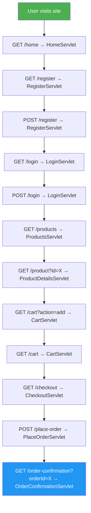
